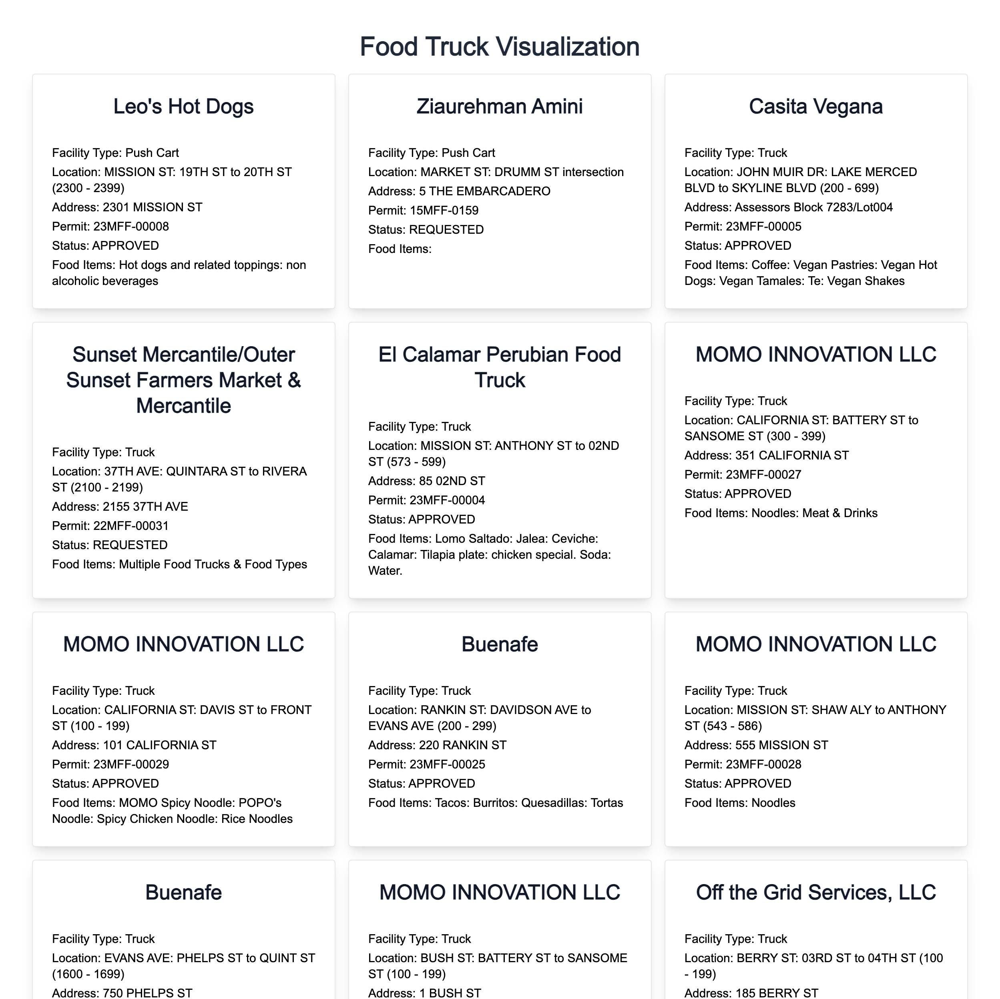

# Food Truck Web App

Visit [The Food Truck Web App](https://food-truck-theta.vercel.app/) live.

## Screenshots



## Start the project locally

It is a demo app built on top of Next.js, using React to render the data out, and Tailwind for style.

I like to use `bun` for tooling, and of course `npm` works as well, feel free to use your own tools.

```
npm install
npm run dev
```

port is at `localhost:3000`

## Todos for the future maybe

- [] Randomize 3 lunch ideas every day, easier for the team to pick from.
- [] Highlight the randomize ideas, adding maybe borders to stand out from the rest.
- [x] Adding filters for types of lunch.(e.g. tacos or burgers)
